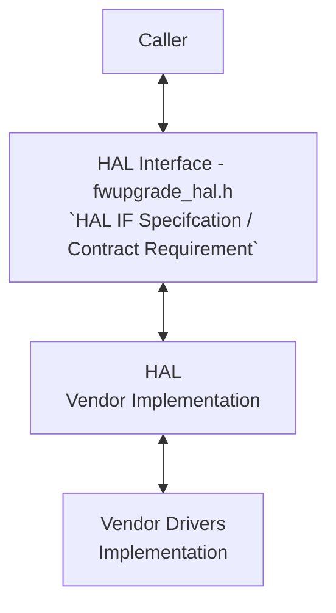
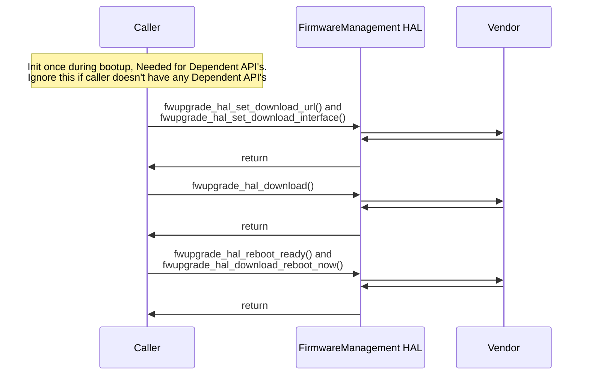

# Firmware Management HAL Documentation

## Acronyms

- `HAL` \- Hardware Abstraction Layer
- `RDK-B` \- Reference Design Kit for Broadband Devices
- `CPE` \- Customer Premises Equipment
- `OEM` \- Original Equipment Manufacture
- `URL` \- Uniform Resource Locator

## Description

The Firmware Management HAL (Hardware Abstraction Layer) module provides a standardized interface for managing firmware upgrades on devices within an RDK (Reference Design Kit) system. It serves as an abstraction layer between the firmware upgrade application and the underlying hardware, enabling a consistent way to perform firmware-related operations regardless of the specific device or platform.

### Key Functionalities

- **Image Download:** Initiates and manages the download of firmware images from a specified source, ensuring integrity and security.
- **Image Verification:** Verifies the downloaded firmware images using checksums or other mechanisms to ensure their validity before installation.
- **Image Installation:** Applies the downloaded and verified firmware image to the target device, following the appropriate installation procedures.
- **Upgrade Status Tracking:** Monitors and reports the progress and status of firmware upgrades, including success, failure, or ongoing operations.
- **Rollback and Recovery:** Provides mechanisms for rolling back to previous firmware versions in case of issues during or after the upgrade process.
- **Configuration:** Allows for customization of firmware upgrade parameters, such as download protocols, storage locations, and installation options.

In essence, the Firmware Management HAL simplifies and standardizes the process of upgrading firmware on RDK devices, providing a consistent and reliable interface for managing this critical aspect of device maintenance and functionality.

The diagram below describes a high-level software architecture of the  Firmware Management HAL module stack.

## Component Runtime Execution Requirements

### Initialization and Startup

The Firmware Management HAL layer/code provides the following APIs to manage firmware upgrades and factory resets. To ensure correct operation, the client should call these APIs in the specified order:

- `fwupgrade_hal_set_download_url()`: Sets the URL from which the firmware image will be downloaded.
- `fwupgrade_hal_set_download_interface()`: Configures the network interface for the download.
- `fwupgrade_hal_download()`: Initiates the firmware download from the configured URL.
- `fwupgrade_hal_reboot_ready()`: Checks if the system is prepared for a reboot after the download.
- `fwupgrade_hal_download_reboot_now()`: Triggers a reboot to apply the downloaded firmware.

**Additional API:**

- `fwupgrade_hal_update_and_factoryreset()`: Combines firmware update and factory reset in a single reboot operation.

**Implementation Note:**

Third-party vendors must implement these APIs to meet specific operational requirements. Be aware that these interfaces might block execution if the underlying hardware is not ready for the operation.

## Threading Model

**Requirement:** The Firmware Management HAL interface itself does not need to be inherently thread-safe. It is the responsibility of the calling modules or components to ensure thread-safe access and usage of the HAL APIs.

**Vendor Implementation:**

Vendors can create internal threading and event mechanisms within their firmware management implementations to meet specific operational needs. However, vendors are responsible for ensuring that these mechanisms:

- **Properly synchronize:** Access to the Firmware Management HAL APIs to prevent race conditions and data corruption.
- **Clean up resources:** Release any allocated resources (e.g., memory, threads) when the implementation is no longer needed.

## Process Model

All APIs are expected to be called from multiple processes. Due to this concurrent access, vendors must implement protection mechanisms within their API implementations to handle multiple processes calling the same API simultaneously. This is crucial to ensure data integrity, prevent race conditions, and maintain the overall stability and reliability of the system.

## Memory Model

### Caller Responsibilities

- Manage memory passed to specific functions as outlined in the API documentation. This includes allocation and deallocation to prevent leaks.

### Module Responsibilities

- Handle and deallocate memory used for its internal operations.
- Release all internally allocated memory upon closure to prevent leaks.

TODO: State a footprint requirement. Example: This should not exceed XXXX KB.

## Power Management Requirements

The HAL is not involved in any of the power management operation.

## Asynchronous Notification Model

There are no asynchronous notifications.

## Blocking calls

**Synchronous and Responsive:** All APIs within this module should operate synchronously and complete within a reasonable timeframe based on the complexity of the operation. Specific timeout values or guidelines may be documented for individual API calls.

**Timeout Handling:** To ensure resilience in cases of unresponsiveness, implement appropriate timeouts for API calls where failure due to lack of response is a possibility. Refer to the API documentation for recommended timeout values per function.

**Non-Blocking Requirement:** Given the single-threaded environment in which these APIs will be called, it is imperative that they do not block or suspend execution of the main thread. Implementations must avoid long-running operations or utilize asynchronous mechanisms where necessary to maintain responsiveness.

TODO: Improvements to this documentation

- **Define API Response Time Requirements:**
  - For each API, specify the expected maximum response time under normal operating conditions.
  - Consider factors like network latency, hardware limitations, and the complexity of the operation.
  - If applicable, reference relevant DOCSIS or RDK-B specifications for guidance on response time expectations.
- **Implement Timeout Mechanisms:**
  - Add timeout mechanisms to API calls that may be susceptible to external delays or unresponsiveness.
  - Document the default timeout values for each applicable API in the header file.
  - Allow for customization of timeout values where appropriate.

## Internal Error Handling

**Synchronous Error Handling:** All APIs must return errors synchronously as a return value. This ensures immediate notification of errors to the caller.
**Internal Error Reporting:** The HAL is responsible for reporting any internal system errors (e.g., out-of-memory conditions) through the return value.
**Focus on Logging for Errors:** For system errors, the HAL should prioritize logging the error details for further investigation and resolution.

## Persistence Model

There is no requirement for HAL to persist any setting information.

## Nonfunctional requirements

Following non functional requirement should be supported by the component.

## Logging and debugging requirements

The Firmware Management HAL component is required to record all errors and critical informative messages to aid in identifying, debugging, and understanding the functional flow of the system. Logging should be implemented using the `syslog` method, as it provides robust logging capabilities suited for system-level software. The use of printf is discouraged unless syslog is not available.

All HAL components must adhere to a consistent logging process. When logging is necessary, it should be performed into the `fwupgrade_vendor_hal.log` file, which is located in either the `/var/tmp/` or `/rdklogs/logs/` directories.

Logs must be categorized according to the following log levels, as defined by the Linux standard logging system, listed here in descending order of severity:

- **FATAL:** Critical conditions, typically indicating system crashes or severe failures that require immediate attention.
- **ERROR:** Non-fatal error conditions that nonetheless significantly impede normal operation.
- **WARNING:** Potentially harmful situations that do not yet represent errors.
- **NOTICE:** Important but not error-level events.
- **INFO:** General informational messages that highlight system operations.
- **DEBUG:** Detailed information typically useful only when diagnosing problems.
- **TRACE:** Very fine-grained logging to trace the internal flow of the system.
  
Each log entry should include a timestamp, the log level, and a message describing the event or condition. This standard format will facilitate easier parsing and analysis of log files across different vendors and components.

## Memory and performance requirements

The component should be designed for efficiency, minimizing its impact on system resources during normal operation. Resource utilization (e.g., CPU, memory) should be proportional to the specific task being performed and align with any performance expectations documented in the API specifications.

## Quality Control

To ensure the highest quality and reliability, it is strongly recommended that third-party quality assurance tools like `Coverity`, `Black Duck`, and `Valgrind` be employed to thoroughly analyze the implementation. The goal is to detect and resolve potential issues such as memory leaks, memory corruption, or other defects before deployment.

Furthermore, both the HAL wrapper and any third-party software interacting with it must prioritize robust memory management practices. This includes meticulous allocation, deallocation, and error handling to guarantee a stable and leak-free operation.

## Licensing

The implementation is expected to released under the Apache License 2.0.

## Build Requirements

The source code should be capable of, but not be limited to, building under the Yocto distribution environment. The recipe should deliver a shared library named as `libfw_upgrade.so`.

## Variability Management

The role of adjusting the interface, guided by versioning, rests solely within architecture requirements. Thereafter, vendors are obliged to align their implementation with a designated version of the interface. As per Service Level Agreement (SLA) terms, they may transition to newer versions based on demand needs.

Each API interface will be versioned using [Semantic Versioning 2.0.0](https://semver.org/), the vendor code will comply with a specific version of the interface.

## Platform or Product Customization

None

## Interface API Documentation

All HAL function prototypes and datatype definitions are available in `fwupgrade_hal.h` file.

  1. Components/Processes must include `fwupgrade_hal.h` to make use of Firmware Management HAL capabilities.
  2. Components/Processes should add linker dependency for `libfw_upgrade.so`

## Theory of operation and key concepts

The Firmware Upgrade HAL (Hardware Abstraction Layer) interface facilitates firmware updates for devices. This involves downloading firmware images, managing device reboots, and potentially performing factory resets.

### Object Lifecycles

The HAL interface doesn't explicitly manage objects in the traditional sense (i.e., instances of classes). Instead, it primarily deals with:

- **Configuration Parameters:** These are set using functions like `fwupgrade_hal_set_download_url` and `fwupgrade_hal_set_download_interface`. These parameters are likely stored internally by the HAL implementation, but their exact lifetime and management are not exposed in the interface.

- **Firmware Images:** Downloaded and potentially installed during the update process. The lifecycle of these images is typically managed by the underlying firmware update mechanism, not directly by the HAL interface.

### Method Sequencing

There is a logical sequence in which methods should be called:

1. **Configuration:** Functions like `fwupgrade_hal_set_download_url` and `fwupgrade_hal_set_download_interface` should be called first to configure the update process.

2. **Download:** `fwupgrade_hal_download` initiates the download.

3. **Status Checking (Optional):** `fwupgrade_hal_get_download_status` can be used to monitor progress.

4. **Reboot (If Applicable):** `fwupgrade_hal_reboot_ready` checks if a reboot is needed, and `fwupgrade_hal_download_reboot_now` can initiate it.

5. **Advanced Operations (Optional):** Functions like `fwupgrade_hal_update_and_factoryreset` and `fwupgrade_hal_download_install` are used for special cases.

### State-Dependent Behavior

The behavior of some methods depends on the current state of the firmware update process:

- `fwupgrade_hal_get_download_status`: Meaningful only during or after a download has been initiated.

- `fwupgrade_hal_reboot_ready` and `fwupgrade_hal_download_reboot_now`: Relevant only after a download has completed.

- `fwupgrade_hal_update_and_factoryreset` and `fwupgrade_hal_download_install`: Can be called independently of a standard download process.

### Implicit State Model

While not explicitly documented, there's an implicit state model governing the firmware update process:

1. **Idle:** No update in progress.
2. **Downloading:** Firmware is being downloaded.
3. **Downloaded:** Download complete, awaiting reboot (or other action).
4. **Rebooting:** Device is rebooting to apply the update.
5. **Error:** An error occurred during the update process.

The HAL interface should ensure that methods are called in a way that's consistent with this implicit state model.

## Sequence Diagram

